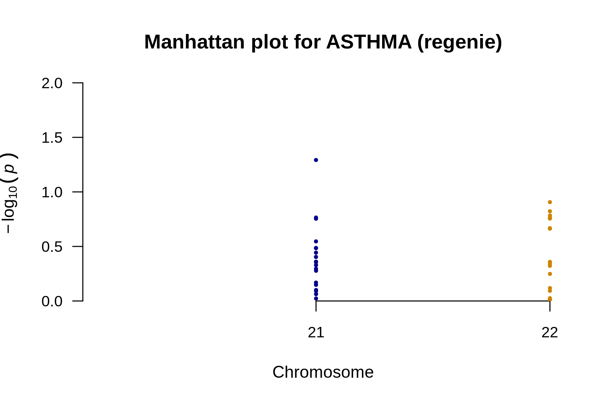

# QQ plot for ASTHMA


---

# Manhattan plot for ASTHMA



---

# Manhattan plot for ASTHMA


---

# Result files
```
output/phenotypes_ASTHMA.regenie.analysis_summary.md
output/phenotypes_ASTHMA.regenie.manhattan_annotated.png
output/phenotypes_ASTHMA.regenie.manhattan.png
output/phenotypes_ASTHMA.regenie.plot_data.rds
output/phenotypes_ASTHMA.regenie.qq.png
output/phenotypes_ASTHMA.regenie.snp_counts.txt
output/phenotypes_ASTHMA.regenie.snp_stats.gz
output/phenotypes_ASTHMA.regenie.snp_stats.log
output/phenotypes_ASTHMA.regenie.snp_stats_original_columns.gz
```
