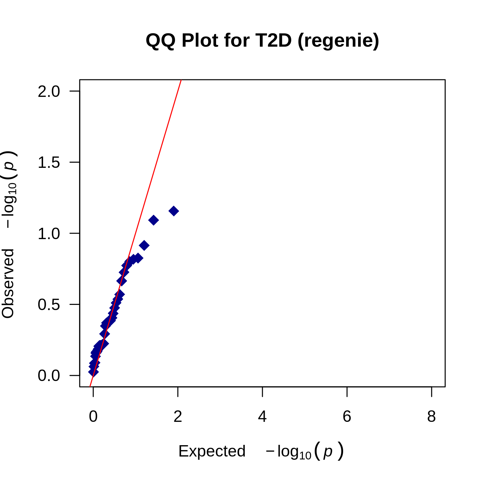
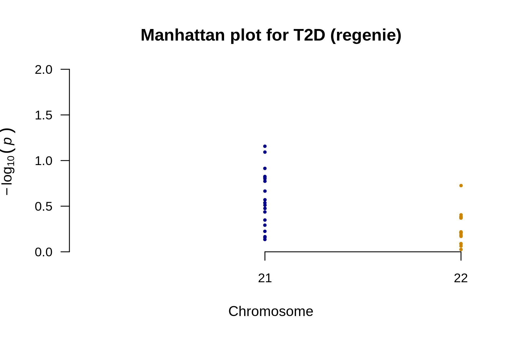
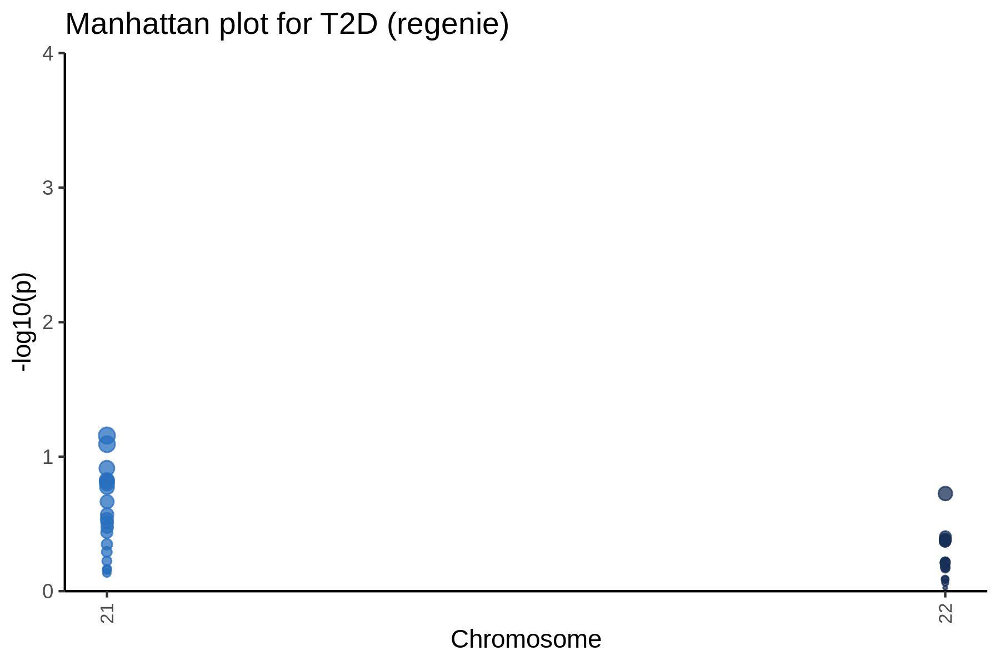

# QQ plot for T2D



---

# Manhattan plot for T2D



---

# Manhattan plot for T2D



---

# Result files
```
output/phenotypes_T2D.regenie.analysis_summary.md
output/phenotypes_T2D.regenie.manhattan_annotated.png
output/phenotypes_T2D.regenie.manhattan.png
output/phenotypes_T2D.regenie.plot_data.rds
output/phenotypes_T2D.regenie.qq.png
output/phenotypes_T2D.regenie.snp_counts.txt
output/phenotypes_T2D.regenie.snp_stats.gz
output/phenotypes_T2D.regenie.snp_stats.log
output/phenotypes_T2D.regenie.snp_stats_original_columns.gz
```
